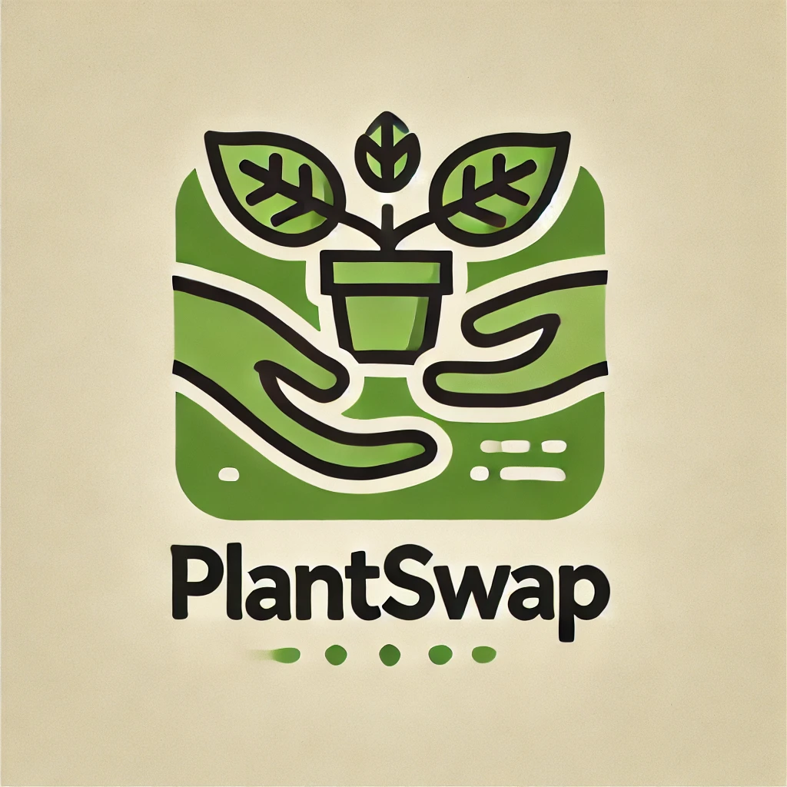

# PlantSwap



[](https://github.com/RaoulLuque/PlantSwap/actions)
[](https://github.com/RaoulLuque/PlantSwap/actions)

PlantSwap is an application which enables you to trade your plant offsets for other plants of your liking.

You can either find a person which wants to trade their plant for your
plant directly or sell your plants on the platform
to receive coins which you can then use the buy plants from other
people.

This repository documents the progress in the cloud computing course I
took part in at the Universidad de Granada for my masters.

The above logo was generated
using [Dall-E](https://openai.com/index/dall-e/).

This project used the [fullstack fastapi template](https://github.com/fastapi/full-stack-fastapi-template) as its starting point.

# Starting up the application

## Prerequisites
The project needs a Postgresql database to be running to be able to use all functionalities. Using a .env file one can pass the application the necessary details of the database. The specific parameters to be set are found in [config.py](app/core/config.py).

The .env file in the project directory contains some default values for the database connection. Using these one can also use the dockerfile contained in the project directory to start a postgresql container. This can be done using the [poethepoet](https://github.com/nat-n/poethepoet) script `db` by typing:

*Attention*: The following command deletes and removes all running docker containers and starts a new postgresql container
````commandline
poe db
````


## Using uv
To start up the application, one will have to install the dependencies first. [uv](https://github.com/astral-sh/uv) is recommended to be installed. An installation guide can be found [here](https://docs.astral.sh/uv/getting-started/). If [pipx](https://pipx.pypa.io/stable/) is already installed on the machine, it is as easy as:
````commandline
pipx install uv
````

After having installed uv, to create a venv and install the necessary dependencies, run:
````commandline
uv python install
uv sync --all-extras --dev
````
The above will install all dependencies and the project could be started using
```commandline
uv run fastapi dev
```
However, the project uses [poethepoet](https://github.com/nat-n/poethepoet) as a task runner. To install poethepoet, run with pipx installed
````commandline
pipx install poethepoet
````

Now the application can be started in development mode running
```commandline
poe dev
```
and in production mode using
````commandline
poe deploy
````

By default, the api will be served at `http://0.0.0.0:8000 `.

## Using docker compose

Using [docker compose](https://docs.docker.com/compose/) and poethepoet, one can start a cluster of containers. One for the application, another one for the postgresql database, and a third one for backup of the database and logging. Starting the cluster is as easy as
```commandline
poe compose
```
with poethepoet. Or 
```commandline
docker compose -f docker-compose.yml up
```
without poe.

# Tech stack
- ⚡ [FastAPI](https://fastapi.tiangolo.com) for the Python backend API.
    - 🧰 [SQLModel](https://sqlmodel.tiangolo.com) for the Python SQL database interactions (ORM).
    - 🔍 [Pydantic](https://docs.pydantic.dev), used by FastAPI, for the data validation and settings management.
    - 💾 [PostgreSQL](https://www.postgresql.org) as the SQL database.
    - 🦄 [Uvicorn](https://github.com/encode/uvicorn) used by FastAPI as ASGI webserver.
- 🚀 React for the frontend. 
  - 🎨 Chakra UI for the frontend components.
  - 🔑 HTML-only cookies for secure authentication.
- 🔒 Secure password hashing by default.
- 🔑 JWT (JSON Web Token) authentication.
- 🧪 Tests with [Pytest](https://pytest.org).
- 🪄 [Poethepoet](https://github.com/nat-n/poethepoet) as task runner.
- 📦 Package management with [uv](https://github.com/astral-sh/uv).
- ⚙️ CI (continuous integration) and CD (continuous deployment) based on [GitHub Actions](https://github.com/features/actions).


# Frontend Template Credits
Blog Article List and With action button & user dropdown from [Chakra Templates](https://github.com/hauptrolle/chakra-templates).


# General development progress of the app

The following list keeps track of the development progress of the app
and its backend/API. Note that the documentation might not be completely up-to-date. For example the authentication setup has changed from a token/bearer system to html-only cookies. Therefore, please refer to commit [12ddcf8](https://github.com/RaoulLuque/PlantSwap/tree/12ddcf866a850121a83acc81eec2763dbc98ac19) or previous for code snippets that match to what is described in the documentation.

## [Basic functionality](https://github.com/RaoulLuque/PlantSwap/milestone/2)

Basic functionality includes things such as:
- [x] Administrators have a (secure) way of logging in
- [x] Users have a (secure) way of logging in
- [x] Users can create accounts
- [x] Administrators can create accounts
- [x] Administrators can delete ads of users
- [x] Administrators can delete accounts of users

## [Advanced functionality](https://github.com/RaoulLuque/PlantSwap/milestone/5)

Advanced functionality includes things such as:
- [x] Users can send other users trade requests for their plants
- [x] Users can accept trade requests
- [ ] Users can deny trade requests
- [ ] Users can answer trade requests with a text message
- [ ] Basic frontend

# Milestones

The following are references to the tasks of the respective milestones
as discussed in
the [repository](https://github.com/cvillalonga/CC-24-25) of the cloud
computing class.

## [Milestone 1](https://github.com/RaoulLuque/PlantSwap/milestone/1)
- 🔧 [Configuration of Git and GitHub](docs/milestone_1/github_configuration.md)
- 📖 [Description of the problem and the application to solve it](docs/milestone_1/problem_description.md)
- ⚖️ [MIT License used for the project](LICENSE)

## [Milestone 2](https://github.com/RaoulLuque/PlantSwap/milestone/3)
- 🤹‍♀️ [Task runner](docs/milestone_2/task_runner.md)
- 🧪 [Testing framework and assertion library](docs/milestone_2/testing_framework_and_assertion_library.md)
- ✍️ [Writing tests](docs/milestone_2/writing_tests.md)
- 🤖 [Continuous integration](docs/milestone_2/continuous_integration.md)
- 📈 [Visualization of continuous integration](docs/milestone_2/visualization_of_continuous_integration.md)

## [Milestone 3](https://github.com/RaoulLuque/PlantSwap/milestone/4)
- 🚀 [API framework used](docs/milestone_3/api_framework.md)
- 🏗️ [Design of API](docs/milestone_3/design_of_api.md)
- 📜 [Logging setup](docs/milestone_3/logging.md)
- 🧪 [Testing update](docs/milestone_3/test_execution.md)

## [Milestone 4](https://github.com/RaoulLuque/PlantSwap/milestone/6)
- 🛠️ [Container composition setup](docs/milestone_4/01_container_composition_setup.md)
- 🐳 [Dockerfile](docs/milestone_4/02_dockerfile_in_depth_explanation.md)
- 📜 [Compose file](docs/milestone_4/03_compose_file_in_depth_explanation.md)
- 📤 [Publishing images](docs/milestone_4/04_automatically_publishing_images.md)
- 🧪 [Testing the composed services](docs/milestone_4/05_automatically_testing_the_composition_of_containers.md)

## [Milestone 5](https://github.com/RaoulLuque/PlantSwap/milestone/7)
- 🌟 [Deploying the application](docs/milestone_5/01_deploying_the_application_to_the_cloud.md)
- 🤖 [Continuous deployment](docs/milestone_5/02_continuous_deployment_using_github_actions.md)
- 📊 [Benchmarking the app](docs/milestone_5/03_performance_benchmarking.md)
