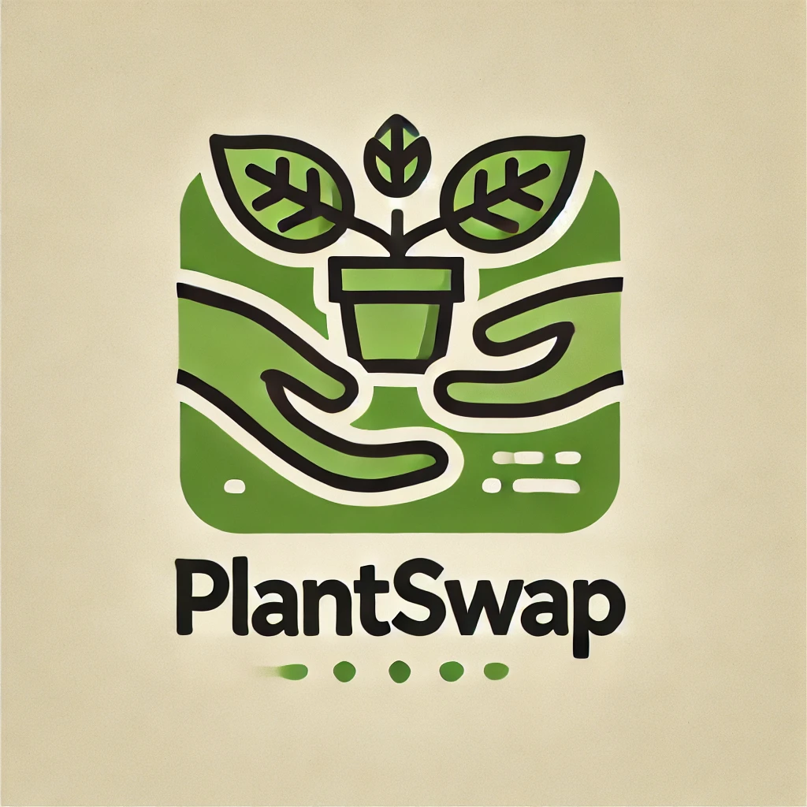

# PlantSwap

PlantSwap is an application which enables you to trade your plant
offsets for other plants of your liking.

You can either find a person which wants to trade their plant for your
plant directly or sell your plants on the platform
to receive coins which you can then use the buy plants from other
people.

This repository documents the progress in the cloud computing course I
took part in at the Universidad de Granada for my master.

The above logo was generated
using [Dall-E](https://openai.com/index/dall-e/).

# General progress of development of the app

The following list keeps track of the development progress of the app
and its backend/API.

## [Basic functionality](https://github.com/RaoulLuque/PlantSwap/milestone/2)

Basic functionality includes things such as:

- [x] [Setup of API without functionality](https://github.com/RaoulLuque/PlantSwap/issues/4)
- [x] [Create (secure) login functionality for administrators](https://github.com/RaoulLuque/PlantSwap/issues/6)
- [x] [Create (secure) login functionality for users](https://github.com/RaoulLuque/PlantSwap/issues/5)
- [x] [Add option for users to create accounts](https://github.com/RaoulLuque/PlantSwap/issues/10)
- [ ] [Add option for users to create ads for their plants](https://github.com/RaoulLuque/PlantSwap/issues/7)
- [ ] [Administrators should be able to delete ads of users](https://github.com/RaoulLuque/PlantSwap/issues/8)

# Milestones

The following are references to the tasks of the respective milestones
as discussed in
the [Repository](https://github.com/cvillalonga/CC-24-25) of the cloud
computing class.

## [Milestone 1](https://github.com/RaoulLuque/PlantSwap/milestone/1)

- 🔧 [Configuration of Git and GitHub](doc/milestone_1/github_configuration.md)
- 📖 [Description of the problem and the application to solve it](doc/milestone_1/problem_description.md)
- ⚖️ [MIT License used for the project](LICENSE)

## Milestone 2

- ...

