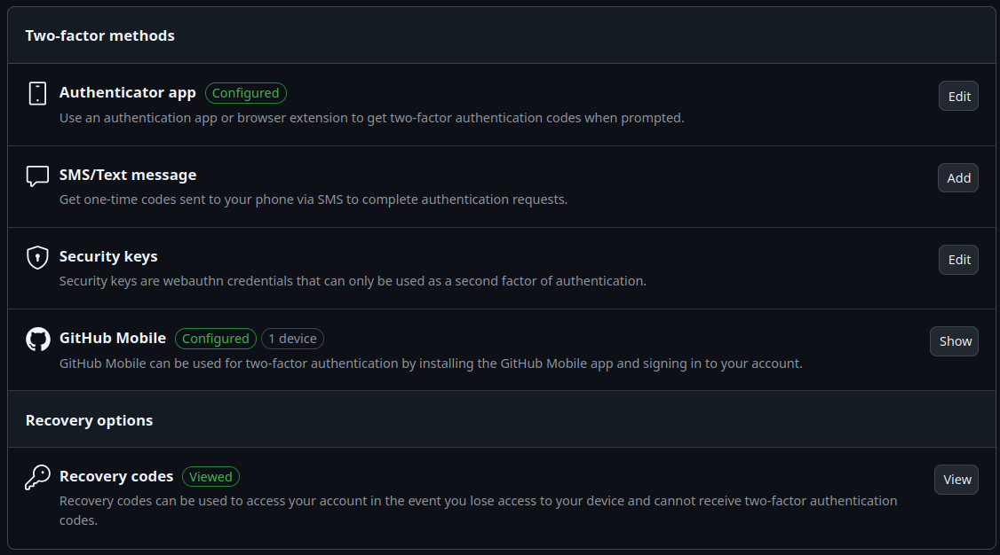

# Configuration of Git(Hub)
Since I already used git for different projects in the past,
it was already installed on my device(s) and most of the configuration was
also already done. Therefore, in the following, I will merely refer to the
different resources that explain the process of setting up git and GitHub
according to our needs. All commands that will be for Linux or more precisely
Ubuntu, as this is the platform I use. However, following the provided links,
references for other operating systems/distributions of Linux can be found.

## Setting up git
A step-by-step guide on how to setup Git by GitHub can be found [here](https://docs.github.com/en/get-started/getting-started-with-git/set-up-git).
The most notable step being installing git. On Ubuntu/Debian this can be done via:
```commandline
apt-get install git
```
Furthermore it is suggested to attach a name and e-mail address to your local
git instance in order to tag your commits with these for reference. This
can be done via
`` git config --global user.name "YOUR NAME"`` and  ``git config --global user.email "YOUR EMAIL" ``
respectively.

One can furthermore set git to always use rebase instead of merging when
the base commit of a branch was updated. This option can be enabled via 
``git config --global pull.rebase true``.

As a last customization option, one may change the default branch name to
main instead of master. This is a preference, however there is a heavy lean
towards avoiding the name master as described in these two articles by
[GitHub](https://github.com/github/renaming?tab=readme-ov-file) and
the [software freedom conservancy](https://sfconservancy.org/news/2020/jun/23/gitbranchname/).

Finally to make sure that the configuration was successful, one can run the
following command:
```commandline
git config --list
```
The output might look something like this:
```commandline
user.name=RaoulLuque
user.email=raoulsluque@gmail.com
color.ui=auto
credential.helper=
credential.helper=/usr/local/bin/git-credential-manager
credential.credentialstore=cache
credential.https://dev.azure.com.usehttppath=true
init.defaultbranch=main
core.autocrlf=input
pull.rebase=true
```
Observe that `user.name`, `user.email`, `init.defaultbranch` and `pull.rebase`
properties are set accordingly.

## Setting up SSH for GitHub
A thorough guide on what SSH is and how to set it up for use with GitHub
can be found [here](https://docs.github.com/en/authentication/connecting-to-github-with-ssh).

As described in the above link, one can use the following command to check
if the ssh connection is set up properly.
```commandline
ssh -T git@github.com
```

The following is the output which proves the correct setup of ssh.
```commandline
Hi RaoulLuque! You've successfully authenticated, but GitHub does not provide shell access.
```
## Setting up the GitHub Profile
As discussed in the beginning, my GitHub Profile was already set up, which is why no further setup was necessary.
The following is the current state of my GitHub profile:


The information about the person can be edited by pushing the 'Edit Profile'
button below the profile picture. GitHub gives the option to furthermore
customize the profile by creating a repository with the own username, in my
case [https://github.com/RaoulLuque/RaoulLuque](https://github.com/RaoulLuque/RaoulLuque).
The README.md of this repository will then be displayed to the right of 
the profile picture as can be seen in the picture above.

At last, as required by GitHub since 2023, [see](https://github.blog/news-insights/product-news/raising-the-bar-for-software-security-github-2fa-begins-march-13/)
I have set at least one other factor of authentication. In my case, both
an authenticator app and the GitHub mobile app as can be seen in the
screenshot below.


