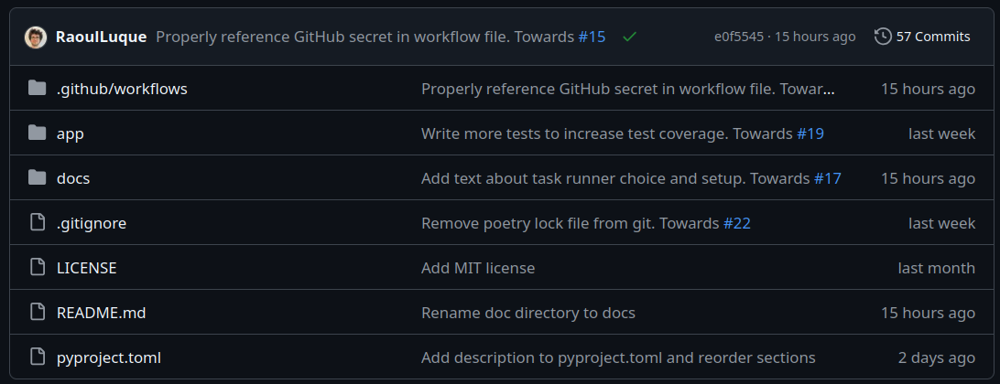
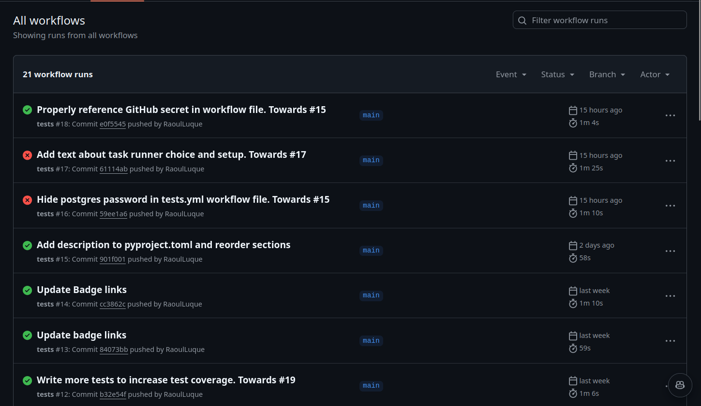
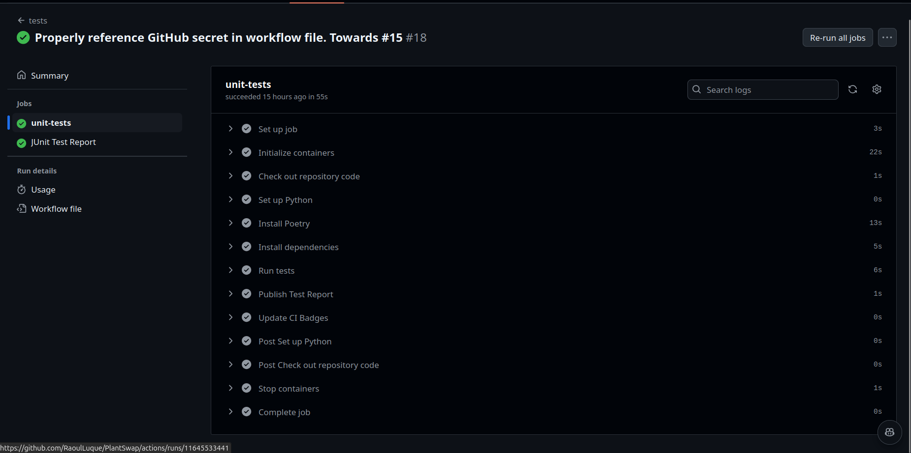

# Continuous Integration

For continuous integration I chose GitHub Actions. This is due to the
easy integration when using GitHub as code repository hosting platform
and the large community around GitHub Actions supporting a lot of
applications and programming languages. Furthermore, GitHub Actions be
used both for continuous integration and continuous delivery platform,
i.e. used to automatically deploy releases in different destinations.

An alternative choice could have been the widely
used [Jenkins](https://www.jenkins.io/) and both choices seem to be
valid in their own ways. While Jenkins offers way more
customizability, this customizability comes at a cost. There is a
large Plugin community for Jenkins, however these are not all
maintained well and/or non-conflicting which can make the setup
process very frustrating. Furthermore, Jenkins does not offer a free
tier themselves, instead the pricing depends on the cloud hosting
platform that one can find. GitHub actions shines in simplicity of
setup and a feature set that is sufficient for our purposes. At last,
and most importantly, GitHub actions offers a free tier, which is why
the latter was ultimately chosen.

## Setup of GitHub Actions

GitHub Actions is integrated natively and by default into GitHub, i.e.
nothing has to be enabled and one can directly start creating
workflows. These workflows are described
in [YAML](https://yaml.org/) (.yml) files which have to simply be put
in the .github/workflow directory of your repository. Depending on the
configuration of your workflow, it will then execute every time a
commit, push or for example, pull request is made to the repository.

To start, lets consider the following simple workflow .yml file taken
from
the [official quickstart guide of GitHub Actions](https://docs.github.com/en/actions/writing-workflows/quickstart):

```YAML
# Header
# Name of the workflow
name: GitHub Actions Demo
# Workflow is run on every push to the repository
on: [ push ]

# Body
jobs:
  # Name of the job
  GitHub-Actions-Demo:
    # Specify the machine/operating system to run the job on
    runs-on: ubuntu-latest
    steps:
      # Run an echo command
      - run: echo "🎉 The job was automatically triggered by a event."
      # Check out the repository code using a GitHub action called checkout@v4 provided by GitHub
      - name: Check out repository code
        uses: actions/checkout@v4
      # Run an echo command
      - run: echo "💡 The repository has been cloned to the runner."
      # The following run instruction has a name
      - name: List files in the repository
        run: ls ${{ github.workspace }}
```

The file is structured in a header containing the name of the workflow
and a body. The name of the workflow being `GitHub Actions Demo` and
`on` specifying when the workflow is supposed to be run. In this case
on every push to the repository.

The body of the YAML file contains the jobs of the workflow, i.e.
different tasks that each can have a list of steps. In this case the
workflow has one job called `GitHub-Acitons-Demo` which first runs an
echo command, then checks out, i.e. copies, the repository code, in
order to then run another echo and ls command.

As seen with the `runs-on` tag, one can also specify on what type of
machine/operating system the workflow is supposed to be run on. If not
specified otherwise, workflows are automatically executed on a server
hosted by GitHub for free (500 MB of storage and 2000 minutes of
server time are included in the GitHub free tier,
see [here](https://docs.github.com/en/billing/managing-billing-for-your-products/managing-billing-for-github-actions/about-billing-for-github-actions)).
One can also self-host GitHub Actions runners.

### Setup of testing database

To properly run the tests for our API, we need a testing database,
which is why our GitHub Actions file is a bit more involved than the
above example. The following excerpt from
the [tests.yml](../../.github/workflows/tests.yml) file shows the
setup of a so-called service container, i.e. a docker container, to
start up a database that can be used for testing the application.

```YAML
jobs:
  unit-tests:
    runs-on: ubuntu-latest
    services:
      # Label used to access the service container
      postgres:
        # Docker Hub image
        image: postgres
        env:
          # Provide the password for postgres
          POSTGRES_PASSWORD: secrets.POSTGRES_PASSWORD
        # Set health checks to wait until postgres has started
        options: >-
          --health-cmd pg_isready
          --health-interval 10s
          --health-timeout 5s
          --health-retries 5
        ports:
          # Maps tcp port 5432 on service container to the host
          - 5432:5432
```

Note that, for security reasons, instead of inserting the postgres
password in plaintext in the test.yml file which can be found in the
public repository, we used
a [GitHub secret](https://docs.github.com/en/actions/security-for-github-actions/security-guides/using-secrets-in-github-actions)
to hide the password as an environment variable that can be set by
repository administrators and only read by the GitHub actions runner.

The rest of the [tests.yml](../../.github/workflows/tests.yml)
contains the steps to run the tests, that is, check out the repository
code, setting up python, installing poetry, installing the
dependencies and running the tests using poetry/pytest. After that,
automatic test reports are created which are attached to the GitHub
Actions task. This is explained more thoroughly
in [this file](visualization_of_continuous_integration.md).

## Using GitHub Actions

The current configuration of the testing CI pipeline can be found
in [tests.yml](../../.github/workflows/tests.yml). It starts everytime
a push to the repository is made and runs all pytest tests displaying
the results on the landing page of the repository and on the actions
tab.

Below there is a screenshot of the landing page of the repository
where a green tick can be seen right next to the header of the last
commit. This tick indicates that the actions triggered by this
push/commit were passed successfully.


Clicking on the actions tab in the repository, a history of the
workflow runs can be seen as displayed in the following screenshot.



Clicking on a specific workflow, we can track the exact steps taken as
shown in the following screenshot. Each of the respective steps can be
expanded to see the exact terminal logs for the respective step.


