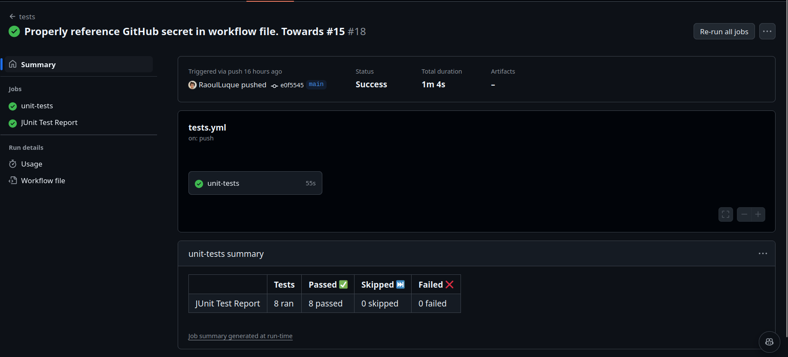
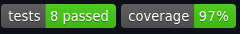

# Visualization of continuous integration

In addition to the intended steps of continuous integration I decided to add some visualization methods to display the current state of continuous integration. More specifically, an automatic test report creation for each workflow run triggered by  [tests.yml](../../.github/workflows/tests.yml) and badges showing the number of tests passed and the code coverage for the last run of  [tests.yml](../../.github/workflows/tests.yml).

## Automatic test report

To create an automatic test report I used the [action-junit-report](https://github.com/mikepenz/action-junit-report) action. With it, the creation of test reports is as easy as adding the following lines to the steps section of the corresponding .yml workflow file:

```YAML
- name: Publish Test Report
  uses: mikepenz/action-junit-report@v4
        # always run even if the previous step fails
        if: success() || failure()
        with:
          report_paths: 'reports/test-results.xml'
          include_passed: 'true'
```
In the above snippet we are referring to a `report_paths` variable, which contains test_results in xml format after pytest was run. This is due to our configuration of pytest as described in the setup of testing framework section in [testing_framework_and_assertion_library.md](testing_framework_and_assertion_library.md#setup-of-testing-framework).

These test reports are then automatically attached to each workflow run and can be seen both in the summary of the workflow run and by clicking on the JUnit Test Report tab, as can be seen in the following screenshot:



## Badges

Upon each workflow run, two badges, in the project README, showing the number of tests passed as well as the test coverage percentage are updated. These can be seen in the following screenshot.



The setup of these was a bit more involved than the test report creation but is explained on the GitHub repository page of the corresponding GitHub action: [ci-badges-action](https://github.com/GaelGirodon/ci-badges-action). Basically, the test coverage and summary files are read out and then posted to a fixed gist repository. These stats containing the number of passed tests and test coverage percentage is then used to create badges using [shields.io](https://shields.io/).
