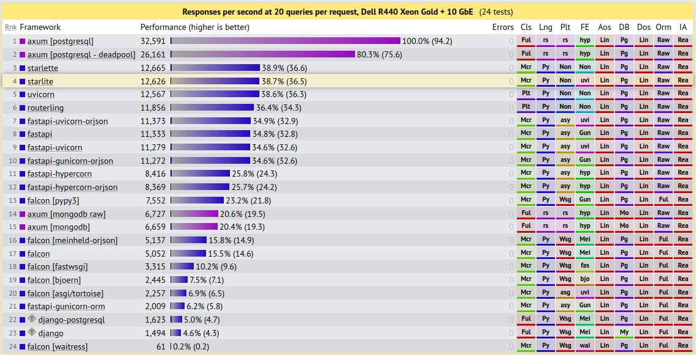

# API Framework
As the API framework I chose FastAPI, a relatively new python web framework from 2018. It stands out with its high performance (in comparison with other Pytho frameworks), focus on type hints and data validation using [Pydantic](https://docs.pydantic.dev/) under the hood. FastAPI actually runs [uvicorn](https://github.com/encode/uvicorn) and [starlette](https://github.com/encode/starlette) under-the-hood. The former being a comparatively fast ASGI server and the latter a lightweight ASGI framework/toolkit. This architecture is why FastAPI is able to achieve such high performance. The following shows a benchmark of FastAPI compared to other python web frameworks. Since python was already chosen as a programming language, it shows other possible known options, such as Flask, Django and Falcon.

Note that the topmost framework [axum](https://github.com/tokio-rs/axum) is actually not a Python framework but instead a [Rust](https://www.techempower.com/benchmarks/#section=data-r22&hw=ph&test=query&l=yyksn3-cfz&f=zhb2t3-zik0zj-zijunz-zik0zj-zik0zj-zik0zj-zik0zj-ziimf3-zik0zj-yeiubj-zik0zj-zhb2tb-zik0zj-zik0zb-1ekf) framework and among the fastest non-esoteric web frameworks that exist right now. I wanted to include it in the comparison just to showcase how much of a restriction it can be to chose python as the programing language instead of other options like rust. Of course in our context performance does not matter as much and we are rather interested in aspects like a steep learning curve, ease-of-use and a large community around the framework to resolve any problems/issues that might come up whilst development. This is exactly what FastAPI offers being a relatively new but very popular web framework with an excellent an user-friendly documentation that can be found [here](https://fastapi.tiangolo.com/).

As will be discussed in the other markdown files regarding [this milestone](../milestone_3), FastAPI also shines with its great automatically generated API documentation, smooth PyTest integration and last but not least, intuitive and easy setup of API endpoints.
