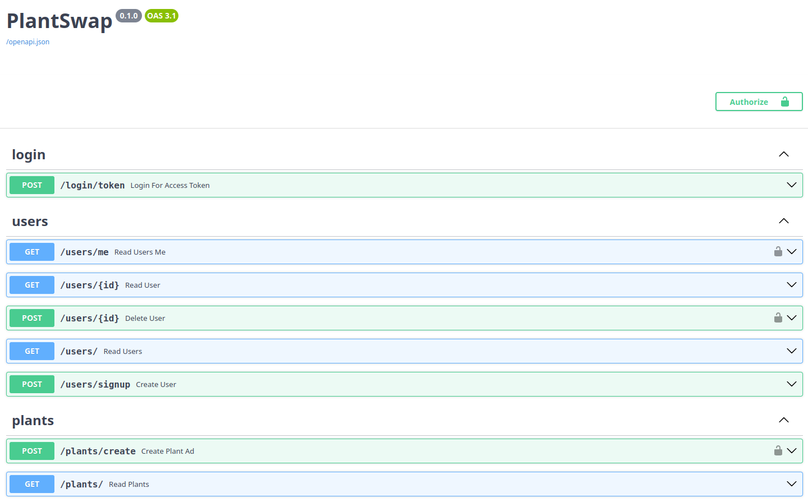
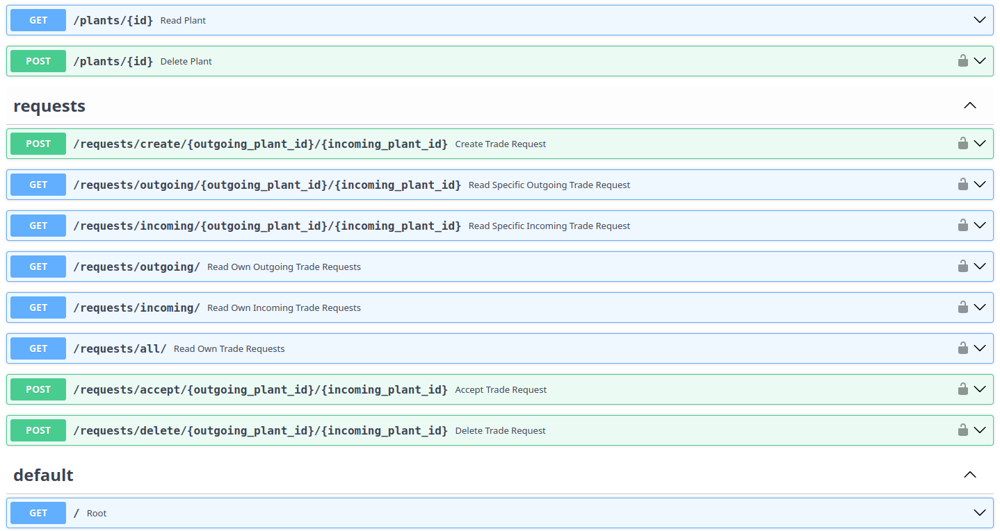
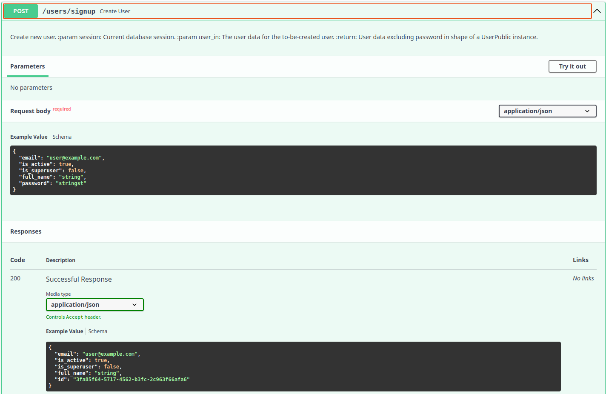
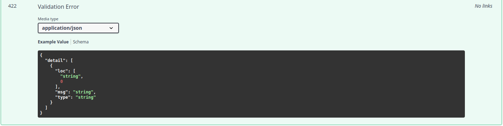

# Design of API, tests and documentation

## Design of API

### Creating API endpoints
As discussed in [api_framework.md](api_framework.md), the code to create an API using FastAPI is very intuitive. A basic example can be found [here](https://fastapi.tiangolo.com/#example) in the documentation.

The following is a snippet from the example from the documentation linked above:
```python
@app.get("/")
def read_root():
    return {"Hello": "World"}
```

In general, every endpoint consists of a standard python function with a decorator above. In this case `@app.get("/")`. The `app` in this case refering to the name of our FastAPI application, the `get` referring to the desired `HTTP` request type to receive, i.e. [get](https://developer.mozilla.org/en-US/docs/Web/HTTP/Methods/GET). The parameter given to the `get` function is then the route the request is supposed to be sent to. The response `{"Hello": "World"}` is then automatically serialized/cast to JSON format to serve the respective browser.

Of course the API endpoints in our app are a bit more elaborate, therefore, lets look at one coming from our app. The following is an example from [users.py](../../app/api/routers/users.py) in `app/api/routers`. 

```python
@router.post("/users/{id}", response_model=UserPublic)
def delete_user(
    session: SessionDep, current_user: CurrentUserDep, id: uuid.UUID
) -> Any:
    """
    Delete user with given id if it matches current_user id or current_user is a superuser.
    :param current_user: Currently logged-in user
    :param id: id of user to be deleted.
    :param session: Current database session.
    :return: User with given id, if deleted successfully.
    """
    if current_user.is_superuser:
        user = session.get(User, id)
        if user is None:
            raise HTTPException(
                status_code=404,
                detail="No user with the given id exists.",
            )
        user = users_crud.delete_user(session, user)
        return user
    else:
        if id != current_user.id:
            raise HTTPException(
                status_code=401,
                detail="You are not allowed to delete other users.",
            )
        user = session.get(User, id)
        user = users_crud.delete_user(session, user)  # type: ignore # (user is not None since exception would have been raised)
        return user
```

The above API endpoint allows user to delete their accounts or superusers to delete arbitrary users' accounts. As we can see, the structure of the endpoint is the same with a python function with a decorator above. In this case the app or rather router is called `router` and we have are looking at an HTTP `post` endpoint. Technically one may also use `delete` HTTP request however we chose `post` for now since it might allow for more flexibility in the future. This is to be determined, however.

As we can see the route of the request contains a variable `id`. This is a path parameter allowing the user to specify the value of this variable via the route path they send their request to. Furthermore, the function seems to have further parameters such as `session` and `current_user`. One might now wonder how these are passed to the function when the function is supposed to act as an endpoint and may not receive any other parameters than `id`. The other two parameters are automatically injected to the function by FastAPI using dependency injection. More specifically the `session` dependency is a dependency for the database automatically created using the function specified in `SessionDep`. Current user on the other hand is a dependency that specifies that the user must be logged in to be allowed to send a request to this endpoint and we can then use the users information in processing the request as seen with the `if current_user.is_superuser` statement.

The rest of the function just tests if the user is actually allowed to delete the user, raises an HTTP exception otherwise and deletes the user by calling a function from the crud module.


### Setting up login functionality
Another upside when using FastAPI is the easy set up of login functionality. This can be seen in [login.py](../../app/api/routers/login.py) in `app/api/routers`. We will not go further into the details of the following code, but I would say the conciseness speaks for itself.

```python
@router.post("/login/token")
async def login_for_access_token(
    session: SessionDep,
    form_data: Annotated[OAuth2PasswordRequestForm, Depends()],
) -> Token:
    """
    OAuth2 Login endpoint according to spec.
    :param session: Database session to check if plant exists
    :param form_data: User data to identify
    :return: Token used for further identification
    """
    user = authenticate_user(session, form_data.username, form_data.password)
    if not user:
        raise HTTPException(status_code=400, detail="Incorrect email or password")
    elif not user.is_active:
        raise HTTPException(status_code=400, detail="Inactive user")
    access_token_expires = timedelta(minutes=settings.ACCESS_TOKEN_EXPIRE_MINUTES)
    access_token = create_access_token(
        data={"sub": user.email}, expires_delta=access_token_expires
    )
    return Token(access_token=access_token, token_type="bearer")
```
For more information check the [security chapter](https://fastapi.tiangolo.com/tutorial/security/) of FastAPIs documentation.

### Folder structure
For the folder structure as well as other parts of the API we orientated ourselves on the officially supported [full-stack FastAPI template](https://github.com/fastapi/full-stack-fastapi-template).
(Split of business and API logic)

The folder structure can be broken down to:

```
app/            # Contains main.py and models for import
    api/        # Contains the API endpoints and logic directly concerning API/routing
    core/       # Contains business logic
    test/       # Contains tests
    main.py     # Main python file that is invoked by FastAPI/uvicorn
    models.py   # Central python file that contains all database and non-database
                # models used and exposed in the API
```

As can be seen, with this design the API code and logic is cleanly separated from the business logic and, as an add-on, imports are simplified.

## Tests
As discussed in [testing_framework_and_assertion_library.md](../milestone_2/testing_framework_and_assertion_library.md) from the documentation of milestone 2, [pytest](https://github.com/pytest-dev/pytest) was chosen as a testing framework.

This was due to the integration of pytest and FastAPI and recommendation from FastAPI of using pytest. Using these two frameworks, testing our API endpoints is as easy as:

```python
def test_read_main(client: TestClient):
    response = client.get("/")
    assert response.status_code == 200
    assert response.json() == {"msg": "Hello World"}
```

The TestClient being a class imported from `fastapi.testclient`. Again we use dependency injection, this time using [`pytest.fixture`](https://docs.pytest.org/en/6.2.x/fixture.html) specified in [conftest.py](../../app/tests/conftest.py). We can then use the test client to simply send http requests to our own application and check the integrity and nature of the response.

As discussed in the setup of database section in [continuous_integration.md](../milestone_2/continuous_integration.md#setup-of-testing-database), we can start a testing database in continuous integration to also test the database connection and interactions. To simplify the process of creating database elements and deleting them after each test to create a clean slate for the next test to run on, we create different util functions in [utils](../../app/tests/utils) such as [contextmanagers](https://docs.python.org/3/library/contextlib.html#contextlib.contextmanager) which yield random users, plants or trade requests and automatically delete them again after test execution. The following is an example of such a contextmanager for creating random users taken from [users.py](../../app/tests/utils/users.py) in `app/tests/utils`.

```python
@contextmanager
def create_random_user(
    database: Session,
) -> Generator[Tuple[User, str], None, None]:
    """
    Context manager for creating a random user with random email and password.
    :param database: Database session.
    :return: User and (un-hashed) password.
    """
    username = random_email()
    password = random_lower_string()
    user_create = UserCreate(email=username, password=password)
    user = users_crud.create_user(database, user_create)
    try:
        yield user, password
    finally:
        users_crud.delete_user(database, user)
```

## Documentation

At last, another benefit of using FastAPI is the automatic generation of the API endpoint documentation in the [OpenAPI schema](https://www.openapis.org/) a widely used schema to describe APIs.

The documentation can be found at `server-url/docs` and currently looks like this showing all API endpoints.



Expanding one of the endpoints, it is specified further and can be tested right on the documentation page if desired.



