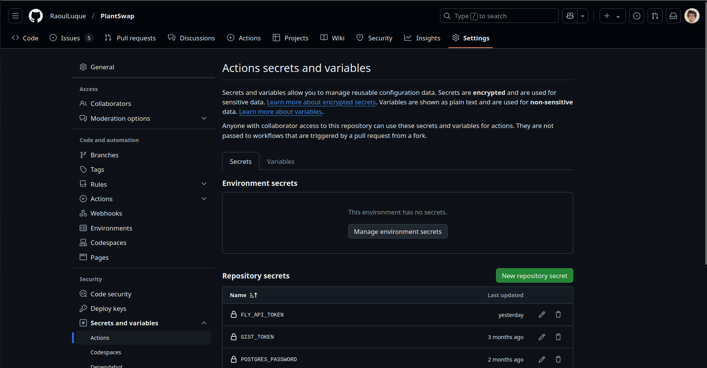

# Continuous deployment using GitHub Actions

Fly.io luckily has some [documentation](https://fly.io/docs/launch/continuous-deployment-with-github-actions/) on how to do continuous integration with GitHub actions with fly.io. In principle it is very straightforward: Create a GitHub action using the fly.io GitHub action and providing a fly.io API Token in the GitHub action. Going through this step-by-step, the following is the GitHub action .yml file we used ([deploy.yml](../../.github/workflows/deploy.yml)):

```yaml
name: Fly Deploy
on:
  push:
    branches:
      - main
jobs:
  deploy:
    name: Deploy app
    runs-on: ubuntu-latest
    concurrency: deploy-group
    steps:
      - uses: actions/checkout@v4
      - uses: superfly/flyctl-actions/setup-flyctl@master
      - run: flyctl deploy --remote-only
        env:
          FLY_API_TOKEN: ${{ secrets.FLY_API_TOKEN }}
```

As can be seen, it is pretty straightforward. We just check-out the repository code and the use the official fly GitHub action to run flyctl deploy providing a `FLY_API_TOKEN`. As explained in the [documentation](https://fly.io/docs/launch/continuous-deployment-with-github-actions/) on continuous integration by fly.io, we were able to create such an API token using the `flyctl tokens create deploy -x 999999h` command.

Then, we added the API Token as a secret to the GitHub repository for it to be available in the GitHub action. This can be seen in the following screenshot.



This already concludes our setup of the continuous deployment using fly.io and GitHub actions. We want to note that the deployment is done on every push to the main branch. This can also be adapted, of course, but is a viable option for our configuration since the process of rolling an update does not cost anything in our case, is quite fast and allows for fast iterations.
