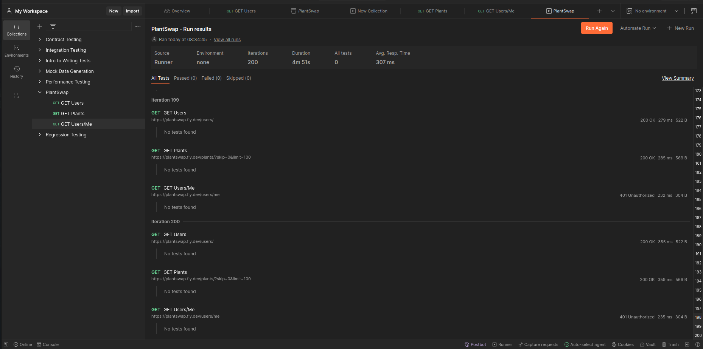
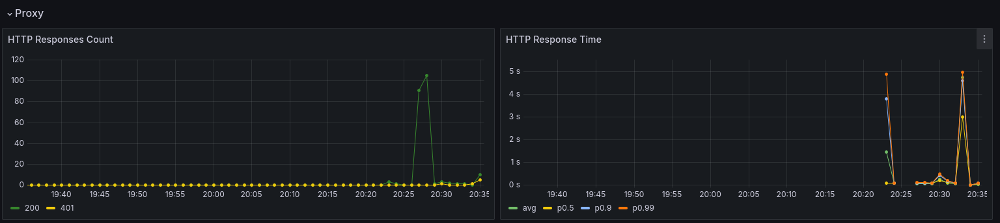

# Performance Benchmarking

As a final add-on, we did some performance benchmarking of our API using [Postman](https://web.postman.co). More precisely, we ran send a collection of three different requests to our service 200 times in a row in quick succession. The requests consisted in on `GET` request of our `/Users/` endpoint which returns all existing users with their public facing data. Also we send `GET` requests to the `/Plants/` endpoint and at last `GET` requests to the `/Users/me` endpoint. The former returns all existing plants ads whereas the latter returns the data of the currently logged in user. Since we were not logged in, it returns a 401 error indicating that the user is not authorized to send this request.

The results of this benchmark can be seen in the following screenshot.

As can be seen, the average response time is 300 ms which can be considered a good result. Of course, one has to bear in mind, that our database does not contain much data with only 2 users and 2 plant ads. But still, considering the quick succession of the requests, this is a result I am happy with.

As a side note, of course fly.io also has a metrics tab on their side showing the results of the benchmark of which a snippet can be seen in the following screenshot.

